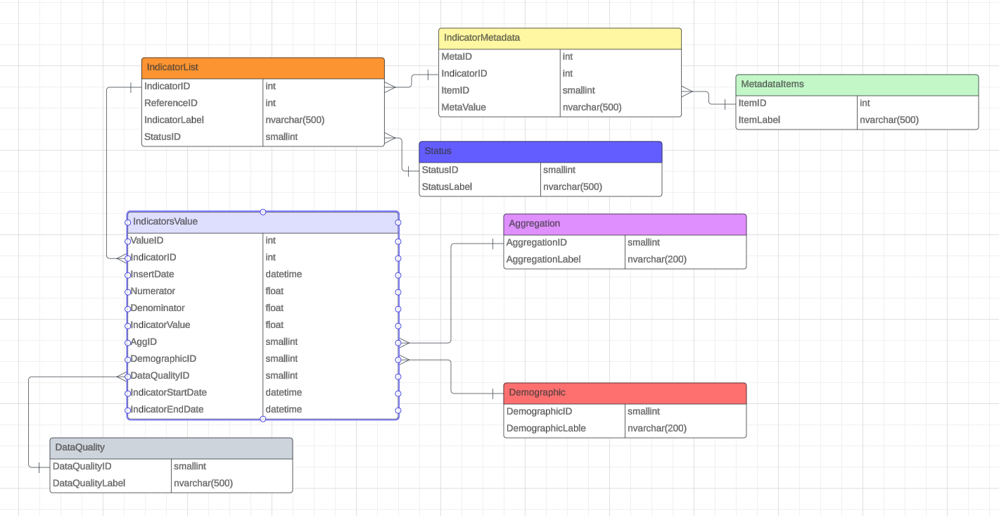

# Database structures

This folder contains the code for defining the agreed data structure in SQL Server Management Studios 2018, connecting to a SQL Server 2019 Datacentre hosted by Midlands and Lancashire CSU.

The data structure can be viewed here: https://lucid.app/lucidchart/d9cd8fe8-b5c9-4aa4-b5fc-5db5e0098a81/edit?viewport_loc=-2863%2C-1275%2C2219%2C1041%2C0_0&invitationId=inv_cd725744-daea-40f5-99c9-38cbd579e135

